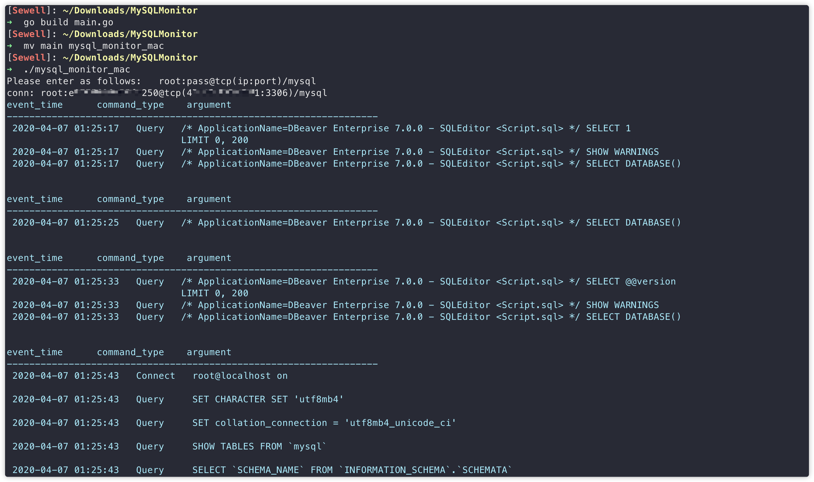

## mysql_monitor

按提示要求输入MySQL数据库连接配置。

自动设置`SET GLOBAL general_log=on`和`SET GLOBAL log_output='table'`，即将SQL log写入mysql.general_log表，监听此表并实时输出。

## Ref

[MySQL-Monitor PHP版](https://github.com/cw1997/MySQL-Monitor)

[go-sniffer 监听本地流量🐂🍻](https://github.com/40t/go-sniffer)